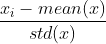

# Feature Scaling
---
### Normalization(정규화)
> 값의 범위를 '최소 0 ~ 최대 1' 로 변환

### Standardization(표준화)
> '평균 0, 분산 1' 인 가우시안 정규분포 값으로 변환

---
이미지 참고) [원문 링크](https://www.analyticsvidhya.com/blog/2020/04/feature-scaling-machine-learning-normalization-standardization/)

